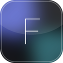
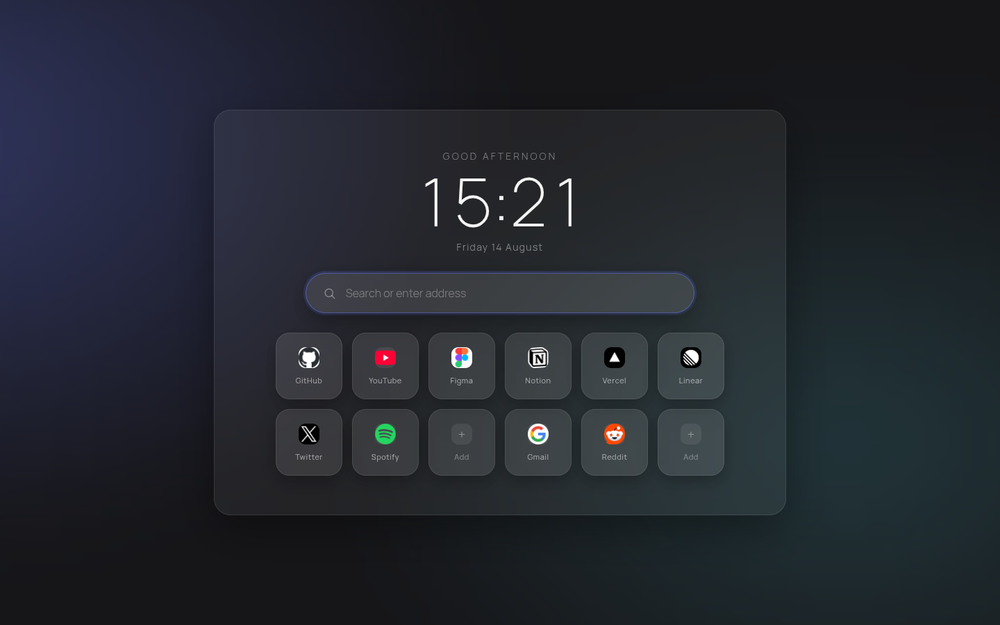
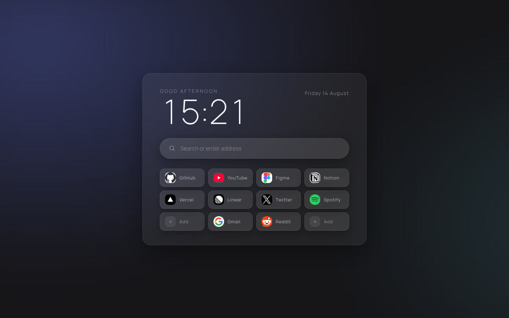
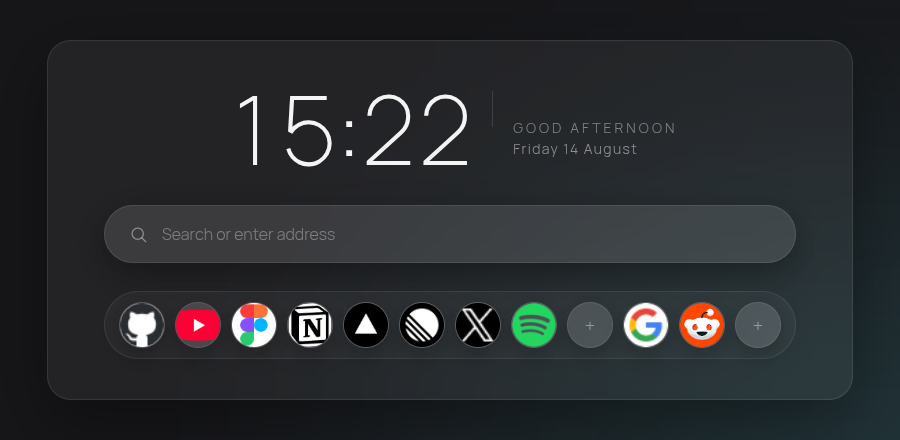
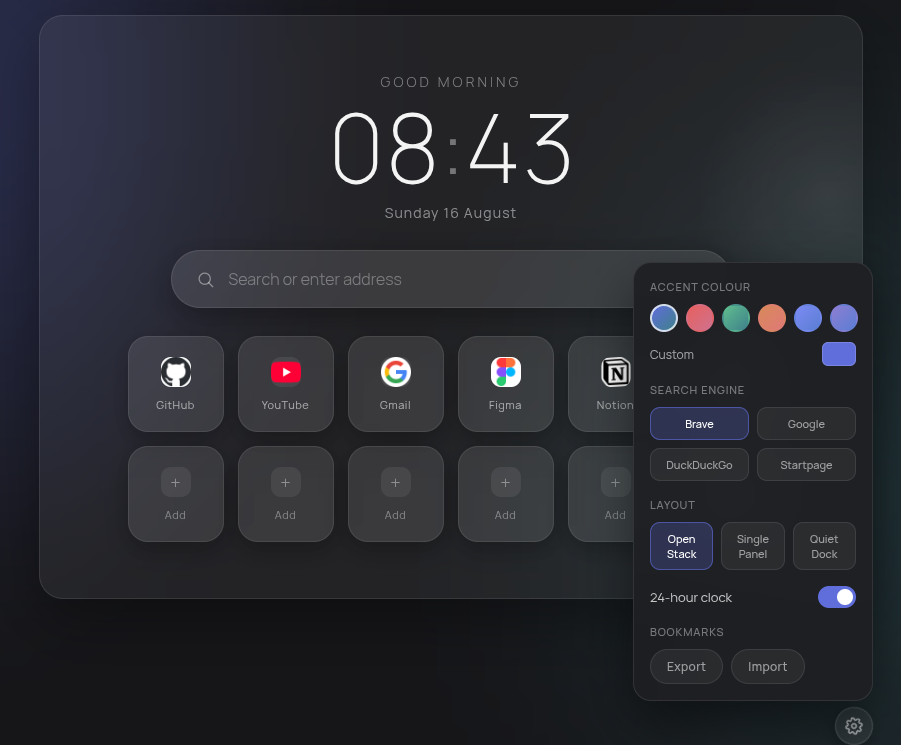

<div align="center">



# Frostpane

**A calm, glass-textured new tab page for Chrome and Brave.**

A live clock, quick search, and a 12-tile bookmark grid — wrapped in a soft, animated frosted-glass surface with three selectable layouts.

[](../../releases/latest)
[](LICENSE)
[](manifest.json)
[](#tech)

<br />



</div>

<br />

## Features

- **Three layouts** — pick the shape that fits how you browse
- **Search engine switcher** — Brave, Google, DuckDuckGo, or Startpage, picked from settings
- **Drag-to-reorder bookmarks** — drag any tile onto another to swap their places, even into an empty slot
- **Live clock** with a 12/24-hour toggle, a softly pulsing colon, auto date, and time-aware greeting
- **Accent themes** — six curated presets plus a custom color picker, rendered as a soft dual-tone glow behind the page
- **12-tile bookmark grid** — click to open, right-click to edit
- **Liquid-glass hover glow** — a cursor-tracked specular highlight sweeps across the frosted card, search bar, and tiles as you move the mouse
- **Frosted, animated bookmark editor** — the add/edit modal opens and closes with a soft blur-and-scale transition
- **Cached favicons** — each icon is fetched once per domain and cached locally, so new tabs load instantly with no repeat network calls
- **Full keyboard navigation** — arrow keys move between bookmarks and the search bar, `Enter`/`Space` opens the focused tile
- **Middle-click** any bookmark to open it in a new tab
- **Liquid ripple** feedback on click, subtle lift-and-zoom on hover
- **Export / Import** your bookmark grid as JSON
- **Hover-revealed settings** — nothing on screen until you ask for it

<br />

## Layouts

<table>
<tr>
<td align="center" width="34%">
<br />
<sub><b>Open Stack</b> — centered clock over a 6×2 grid</sub>
</td>
<td align="center" width="34%">
<br />
<sub><b>Single Panel</b> — one dense card, bookmarks as pills</sub>
</td>
<td align="center" width="34%">
<br />
<sub><b>Quiet Dock</b> — a minimal icon strip, clock as anchor, names on hover</sub>
</td>
</tr>
</table>

Switch between them any time from the settings panel, which appears on hover in the bottom-right corner:

<div align="center">

</div>

<br />

## Keyboard shortcuts

| Key | Action |
| --- | --- |
| `←` `→` `↑` `↓` | Move focus between bookmarks and the search bar |
| `Enter` / `Space` | Open the focused bookmark, or add one to an empty slot |
| Middle-click | Open a bookmark in a new tab |
| `Esc` | Close the settings panel or bookmark editor |

<br />

## Install

Frostpane isn't on the Chrome Web Store — install it as an unpacked extension:

1. Download the latest [release](../../releases/latest) and unzip it, **or** clone the repo:
   ```sh
   git clone https://github.com/talalahmad34/frostpane-home.git
   ```
2. Open `chrome://extensions` (or `brave://extensions`)
3. Enable **Developer mode** (top right)
4. Click **Load unpacked** and select the `frostpane-home` folder
5. Open a new tab

<br />

## Tech

No build step, no framework — vanilla HTML, CSS, and JavaScript, backed by `chrome.storage.local` for persistence. Manifest V3.

<br />

## Changelog

See [CHANGELOG.md](CHANGELOG.md) for release notes.

<br />

## License

[MIT](LICENSE) © [Talal Ahmad](https://github.com/talalahmad34)
