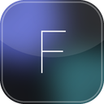
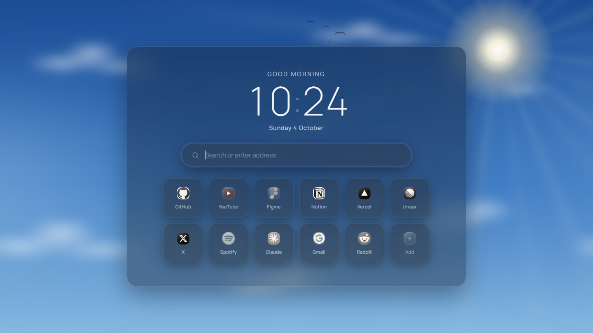
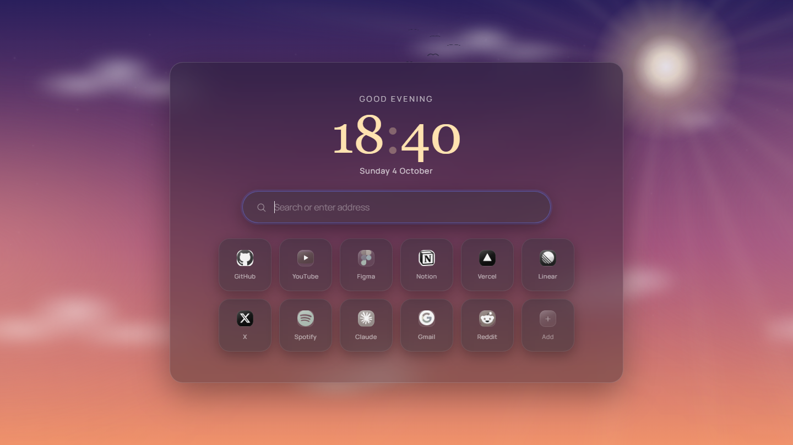
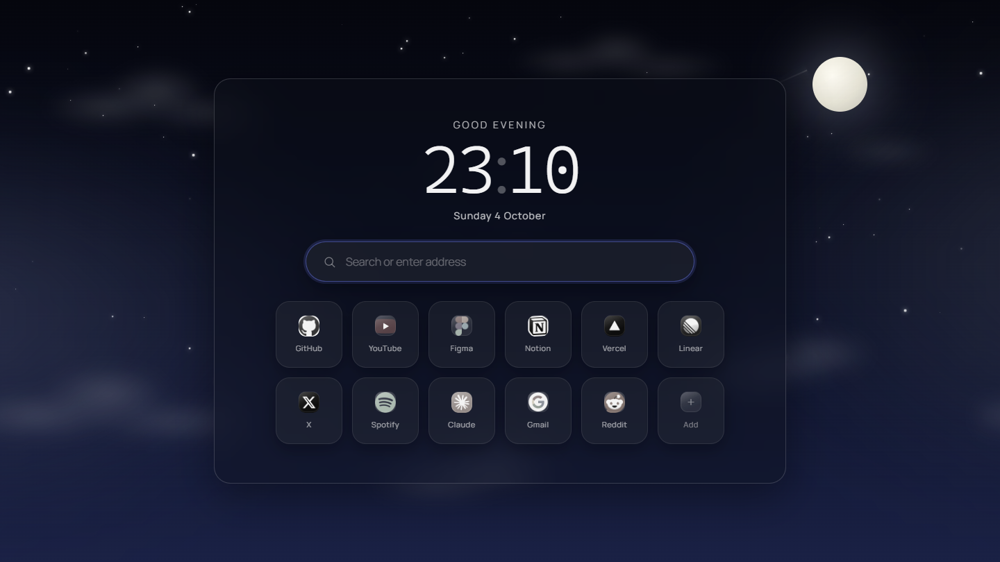
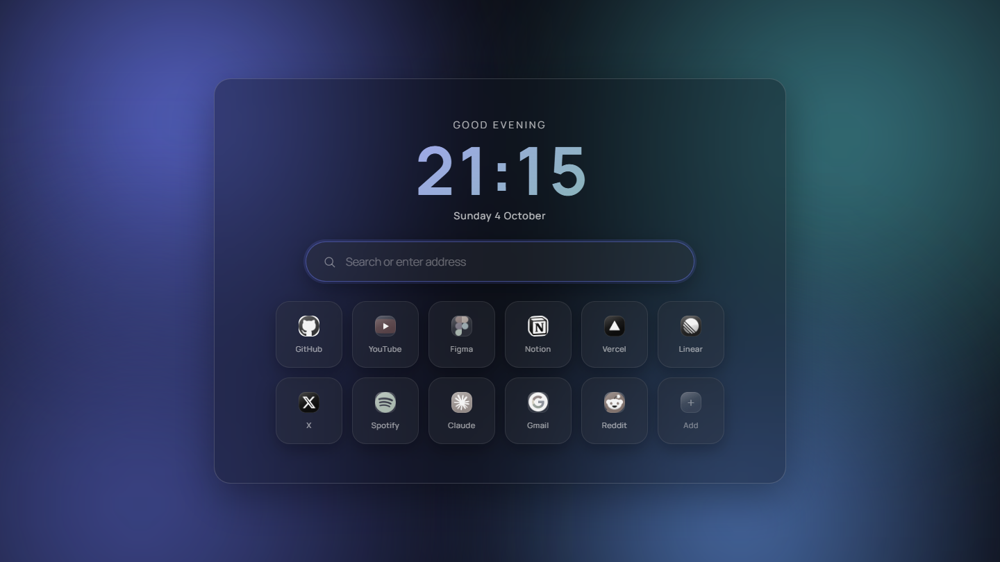
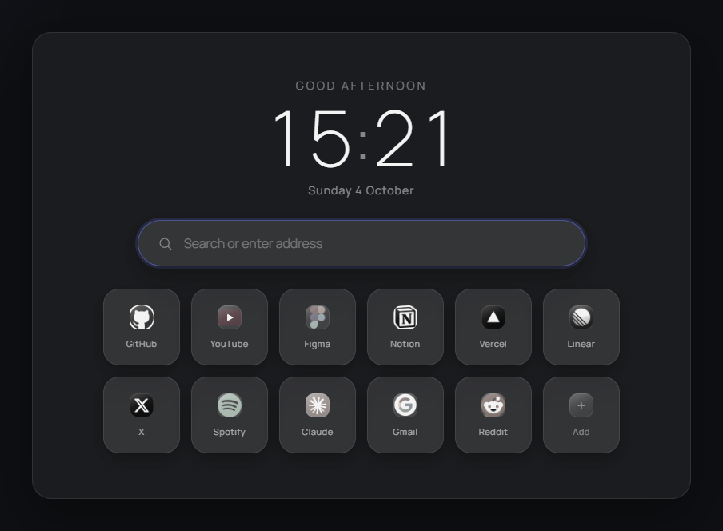
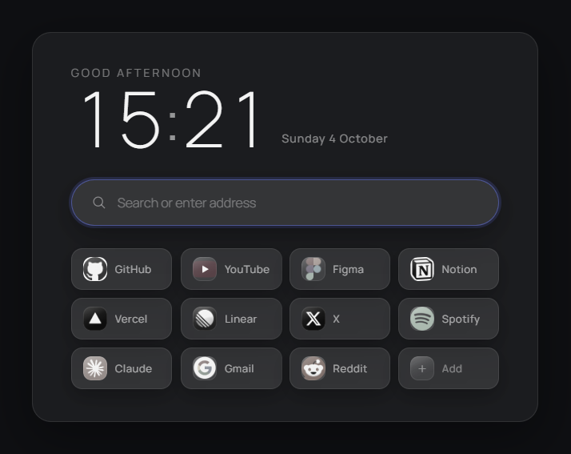
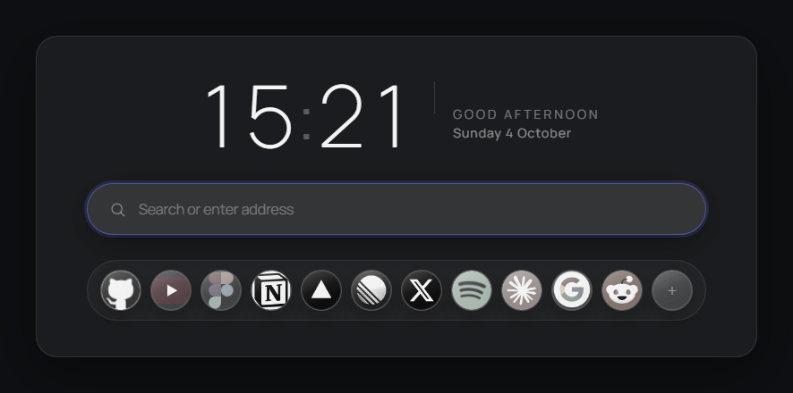
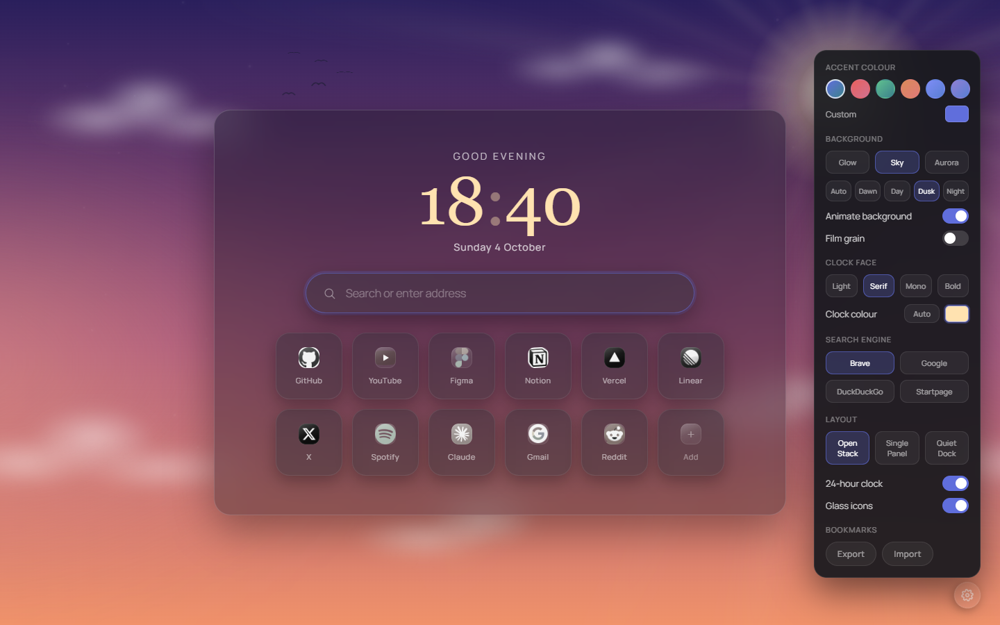

<div align="center">



# Frostpane

**A calm, glass-textured new tab page for Chrome, Brave, and other Chromium browsers.**

A live clock, quick search, and twelve bookmarks on a frosted-glass card, over a background that moves.

[](../../releases/latest)
[](LICENSE)
[](manifest.json)
[](#tech)

<br />



</div>

<br />

## Highlights

- **Three backgrounds** — a soft Glow, a living Sky, or a drifting Aurora
- **Four clock faces** in any colour you pick
- **Three layouts**, from a roomy grid to a minimal dock
- **Twelve bookmarks** with frosted-glass icons, reordered by dragging
- **Quick search** through Brave, Google, DuckDuckGo, or Startpage
- **Nothing on screen until you ask** — settings appear on hover, and everything is saved in your browser

<br />

## Backgrounds

<table>
<tr>
<td align="center" width="50%">
<br />
<sub><b>Sky</b> — follows the clock through dawn, day, and dusk, with a sun glare on opening, drifting clouds, and passing birds</sub>
</td>
<td align="center" width="50%">
<br />
<sub><b>Sky at night</b> — twinkling stars, a moon, and shooting stars</sub>
</td>
</tr>
<tr>
<td align="center" width="50%">
<br />
<sub><b>Aurora</b> — slow colour fields built from your accent colour</sub>
</td>
<td align="center" width="50%">
<br />
<sub><b>Glow</b> — the original: a dark page with two soft drifting lights</sub>
</td>
</tr>
</table>

Sky can follow the time of day or stay pinned to one phase. Any background can take a film-grain texture, and one switch freezes the motion without changing the look.

<br />

## Layouts

<table>
<tr>
<td align="center" width="34%">
<br />
<sub><b>Open Stack</b> — centered clock over a 6×2 grid</sub>
</td>
<td align="center" width="34%">
<br />
<sub><b>Single Panel</b> — one dense card, bookmarks as pills</sub>
</td>
<td align="center" width="34%">
<br />
<sub><b>Quiet Dock</b> — a minimal icon strip, names on hover</sub>
</td>
</tr>
</table>

<br />

## Settings

Hover the bottom-right corner for the settings panel. It stays open while you change things, so every option previews live.

<div align="center">

</div>

<br />

## Everything it does

<details>
<summary><b>Look and feel</b></summary>

- **Accent colour** — six presets or any colour from the built-in picker
- **Clock faces** — Light, Serif, Mono, or Bold with an accent gradient, plus an optional clock colour
- **Glass icons** — bookmark icons are desaturated and given a soft sheen so the grid reads as one pane of glass; full colour returns on the tile you hover, and a switch restores the original logos
- **Liquid-glass highlights** — a soft light follows the cursor across the card, search bar, and tiles
- **12 or 24-hour clock**, with the date and a greeting that matches the time of day
- **Respects reduce motion** — every animation stands down when your system asks for less movement

</details>

<details>
<summary><b>Bookmarks</b></summary>

- Click a tile to open it, right-click to edit, click an empty tile to add
- Drag one tile onto another to swap them, including into an empty slot
- Ctrl-click or middle-click opens a bookmark in a new tab
- Icons are fetched once and cached, so new tabs open instantly; the cache cleans itself up as bookmarks change

</details>

<details>
<summary><b>Backup</b></summary>

- **Export** saves your bookmarks and every setting to one JSON file
- **Import** restores it wherever Frostpane is installed; bookmark files from older versions still work

</details>

<br />

## Keyboard shortcuts

| Key | Action |
| --- | --- |
| `←` `→` `↑` `↓` | Move focus between bookmarks and the search bar |
| `Enter` / `Space` | Open the focused bookmark, or add one to an empty slot |
| `Ctrl`-click / `Cmd`-click | Open a bookmark in a new tab |
| Middle-click | Open a bookmark in a new tab |
| `Esc` | Close the settings panel or bookmark editor |

<br />

## Install

Frostpane isn't on the Chrome Web Store — install it as an unpacked extension:

1. Download the latest [release](../../releases/latest) and unzip it, **or** clone the repo:
   ```sh
   git clone https://github.com/talalahmad34/frostpane-home.git
   ```
2. Open `chrome://extensions` (or `brave://extensions`)
3. Enable **Developer mode** (top right)
4. Click **Load unpacked** and select the unzipped folder (or the cloned `frostpane-home` folder)
5. Open a new tab

<br />

## Tech

No build step, no framework — vanilla HTML, CSS, and JavaScript, backed by `chrome.storage.local` for persistence. Manifest V3. The only network requests are for bookmark icons.

<br />

## Changelog

See [CHANGELOG.md](CHANGELOG.md) for release notes.

<br />

## License

[MIT](LICENSE) © [Talal Ahmad](https://github.com/talalahmad34)
